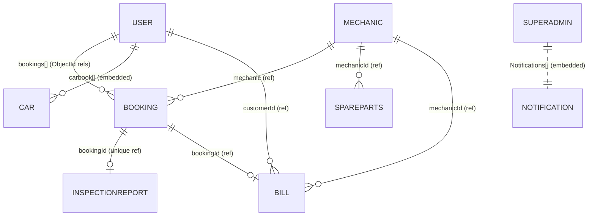

# 05 — Database

**MongoDB** (Atlas cluster `cluster0.wbp76kx.mongodb.net`) via **Mongoose 5**. Connection string is **hard-coded in `index.js`** (not from env). No migrations, no seed scripts.

## Entity-relationship overview

> Important: `Booking` stores the customer as an **embedded object** (`customer.name/phone/email`), **not** a `User` ref. Linking a booking back to a `User` is done by **matching `customer.phone`** throughout the code. This is the central modeling weakness (fragile joins). Service history even falls back to **matching by license plate**.

## Models

### User (`models/User.js`)
`fullname*`, `phone*` (unique), `email`, `password*` (bcrypt), `pic`, `carbook[]` (embedded: carname, carmodel, caryear, carlicenseplate), `lastService`, `isBlocked` (default false), `bookings[]` (ref Booking), `fcmToken`, `resetOTP`, `resetOTPExpiry`. Timestamps.

### Mechanic (`models/Mechanic.js`)
`profile`, `name*`, `email`, `password*`, `phone*` (Number), `streetaddress* city* state* zip*`, `isActive` (default true), `services[]*` (strings), `latitude* longitude*` (String), `rating*` (String), `reviews[]` (name, rating, comment), `totalbookings`, `mapsLink*`, `notifications[]` (message,type,read), `fcmToken`, `resetOTP`, `resetOTPExpiry`. Timestamps.

### SuperAdmin (`models/SuperAdmin.js`)
`email*`, `password*`, `revenue[]` (month, year, amount), `Notifications[]` (title, date, from), `fcmToken`. **No `phone`/`name`** — which is why `SuperAdmin.loginAdmin` (phone-based) is dead.

### Booking (`models/Bookings.js`)
`customer{name*,phone*,email}` (embedded), `vehicle{make*,model*,year,plateNumber*}`, `serviceType*`, `mechanic` (ref), `odometerReading*`, `dateTime*`, `amount*` (Number), **`status` enum** (see below), `spareParts[]` (strings), `notes`, `selectedServices[]` (id,name,price,duration). Timestamps.

**Status machine:** `pending → confirmed → vehicle_received → inspection_completed → user_approved | user_rejected → in-progress → completed | cancelled`.

### InspectionReport (`models/InspectionReport.js`)
`bookingId*` (ref, **unique** → one report per booking), `mechanicId*` (ref), `customerId` (ref User), `vehicleDetails{make,model,plateNumber}`, `issues[]` (title*, description, estimatedCost*, severity[Low/Medium/High/Critical], recommendedAction), `totalEstimatedCost`, `status`[pending/approved/rejected], `mechanicNotes`, `userNotes`. Timestamps.

### Bill (`models/Bill.js`)
`bookingId*` (ref), `mechanicId*` (ref), `customerId*` (ref), `customerName*`, `customerPhone`, `vehicleDetails{make,model,plateNumber}`, `items[]{name*,price*}`, `totalAmount*`, `advanceReceived`, `generatedAt`, **`billNumber`** (unique, auto `BILL-YYYYMM-00001` via pre-save hook that counts docs), `status`[pending/paid/cancelled]. Timestamps.

### Services (`models/Services.js`)
`serviceName*`, `description*`, `Baseprice*` (String), `duration*`, `category*`, `status` (Boolean, default true). Timestamps.

### SpareParts (`models/SpareParts.js`)
`requestid`, `serviceId`, `mechanicId` (ref), `amount` (unused, "0"), `partName`, `partQuantity`, `carName`, `manufactured_year`, `urgency` (default Medium), `status` (default pending). Timestamps.

### CarouselSlide (`models/CarouselSlide.js`)
`imageUrl*`, `order` (default 0), `isActive` (default true), `createdAt`.

## Indexes & constraints
- **Explicit unique:** `User.phone`, `InspectionReport.bookingId`, `Bill.billNumber`. Mongoose adds `_id`.
- No compound indexes. Geo queries use **application-side Haversine**, not a Mongo geospatial (`2dsphere`) index → full-collection scan on every mechanic search (see `05` in tech debt).
- Types are loose: `latitude/longitude/rating/Baseprice/partQuantity` are **Strings**, parsed at read time. `Bill.billNumber` uses count-based numbering → **race-condition risk** under concurrency.

## Which controllers touch each model
| Model | Primary controllers |
|---|---|
| User | AuthControllers, UserControllers, userprofilecontrollers, bookingprocess, SuperAdmin, serviceHistory |
| Mechanic | MechanicControllers, PublicControllers, SuperAdmin, bookingprocess |
| Booking | bookingprocess, BookingControllers, MechanicControllers, userprofilecontrollers, inspection, serviceHistory, Analytics, bill |
| InspectionReport | inspectionController |
| Bill | billController |
| Services | servicesController, SuperAdmin, bookingprocess |
| SpareParts | sparePartsController, MechanicControllers, SuperAdmin |
| SuperAdmin | AuthAdmin, AdminNotifications, SuperAdmin |
| CarouselSlide | carouselController |

## Confidence: High.
