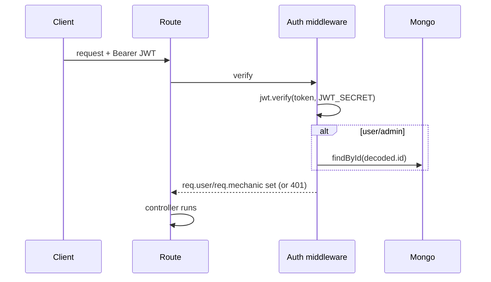

# 06 — Authentication

Three identities, three middlewares, two token shapes. All bearer JWTs signed with `process.env.JWT_SECRET` (fallback literal `'your_jwt_secret'` if unset — a risk).

## Token generation

- **`utils/index.js > generateToken(role, id)`** → `jwt.sign({ role, id }, JWT_SECRET)` — **no `expiresIn`** (non-expiring). Used for **User** and **Admin**.
- **Mechanic** tokens are signed inline in `MechanicControllers`:
  - `register`: `jwt.sign({ mechanic: { id } }, secret, { expiresIn: '24h' })`.
  - `login`: `jwt.sign({ mechanic: { id } }, secret)` — **no expiry**.

## Middlewares

| File | Reads | Verifies | Sets |
|---|---|---|---|
| `authMiddleware.js` | `Authorization: Bearer` | `decoded.id` → `User.findById` | `req.user = { id, phone }` |
| `authmechanic.js` | Bearer | decode only | `req.mechanic = decoded.mechanic` (`{id}`) |
| `authadmin.js` | Bearer | `decoded.id` → `SuperAdmin.findById` exists? | (nothing; just gate) |

> ⚠️ `authadmin` calls `res.status(401)` when admin not found but **does not `return`**, then still calls `next()` — a token for a deleted admin could slip through / cause "headers already sent". Flagged in `15_Tech_Debt.md`.

> ⚠️ `authMiddleware.js` exports a **bare function** (`module.exports = async function`). `userRoutes.js` imports it as `{ protect }` (destructured) → `protect` is `undefined`; but those routes are admin-gated globally anyway, and `userprofile.js` imports it correctly as `auth`. Net effect: `/api/user/*` is protected by `authMiddleware` (the `auth` import), `/api/admin/user/*` is protected by the **global admin gate** (the broken `{protect}` is never actually applied). Confusing but not a hole.

## Login flows

### User — `POST /api/auth/login`
`User.findOne({phone})` → `bcrypt.compare` → returns `{_id, fullname, phone, email, role:"User", token}`.
- ⚠️ **`isBlocked` is not checked** — blocked users can still log in and use the API.

### Mechanic — `POST /api/mechanic/login`
`Mechanic.findOne({phone})` → compare → returns `{token, mechanic:{...}}`.

### Admin — `POST /api/adminauth/login`
`SuperAdmin.findOne({email})` → compare → returns `{_id, email, role:"Admin", token}`. This is the **only working admin login** (the phone-based `SuperAdmin.loginAdmin` is dead + double-gated).

## Password reset (User & Mechanic) — `AuthControllers`
1. `POST /auth/forgot-password {phone, type}` → generate 6-digit OTP, store `resetOTP`+`resetOTPExpiry` (10 min), send via **Twilio SMS**. If SMS fails, OTP is not exposed.
2. `POST /auth/verify-otp {phone, otp, type}` → validates existence/expiry/match.
3. `POST /auth/reset-password {phone, otp, newPassword, type}` → re-validates OTP, bcrypt-hashes new password, clears OTP.
`type: 'mechanic'` targets the Mechanic model; default is User. Admin has no reset flow.

## Auth sequence

## Weaknesses (see `12_Security.md`)
- Non-expiring user/admin tokens; no refresh/rotation/blacklist.
- `JWT_SECRET` fallback literal.
- No `isBlocked` enforcement.
- `authadmin` missing `return`.
- Passwords hashed with **bcryptjs** (fine), but two bcrypt libs installed.

## Confidence: High.
