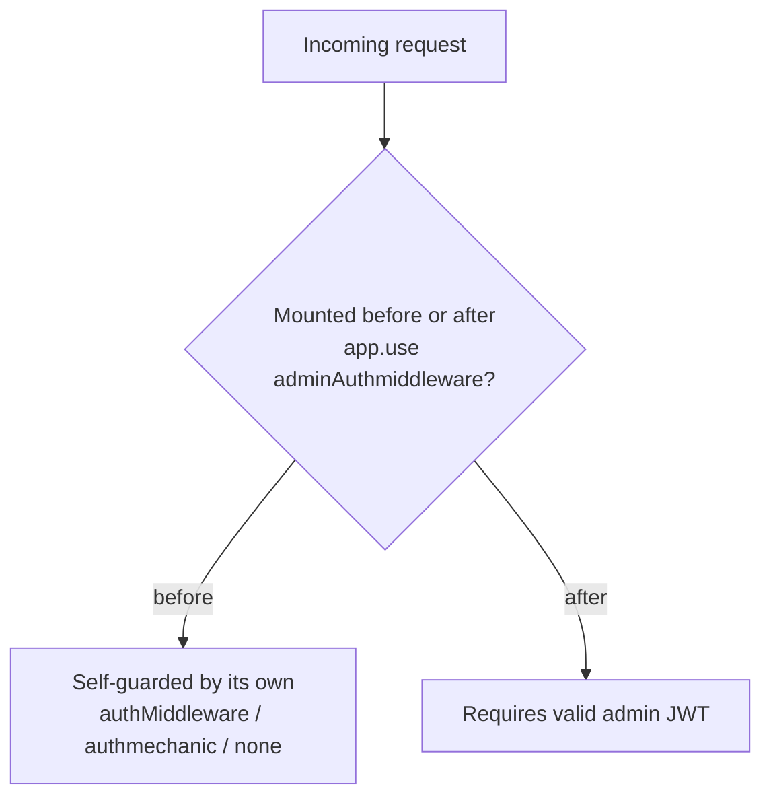

# 07 — Authorization

## Model: position-based, not role-checked

There is **no RBAC layer** (no `role` comparison in middleware). Authorization is achieved by **which middleware guards a route** and **where the route is mounted relative to the global admin gate** in `index.js`.

## Effective authorization matrix

| Route group | Guard | Who can call |
|---|---|---|
| `/api/auth/*`, `/api/adminauth/*`, `/api/public/*`, `GET /api/carousel/public`, `POST /api/fcm-token` | none | anyone |
| `/api/mechanic/*` (except login/register) | `authmechanic` | any valid mechanic JWT |
| `/api/user/*` | `authMiddleware` (`auth`) | any valid user JWT |
| `POST/GET/PUT/DELETE /api/carousel` (non-public) | `adminAuthmiddleware` (per-route) | admin |
| Everything after the global gate (`/api/admin/**`) | `adminAuthmiddleware` (global) | admin |

## Resource-level ownership checks (in controllers)

Some controllers add **object-level authorization** beyond the coarse gate:

| Controller | Check |
|---|---|
| `MechanicControllers.getBookings/updateBookingStatus/getBookingDetails` | queries scoped to `{ mechanic: req.mechanic.id }` |
| `MechanicControllers.getSpareParts` | scoped to `{ mechanicId: req.mechanic.id }` |
| `billController.generateBill` | `booking.mechanic === req.mechanic.id` else 403 |
| `inspectionController.createReport` | booking must belong to the mechanic |
| `inspectionController.submitDecision` | `report.customerId === req.user.id` else 403 |
| `userprofilecontrollers.*` | bookings matched by `customer.phone === req.user.phone` |

## Gaps / risks

1. **No role claim enforced.** A mechanic JWT and an admin JWT are both just `jwt.verify`-able; the only thing stopping a mechanic from hitting admin routes is that `adminAuthmiddleware` does `SuperAdmin.findById(decoded.id)` — a mechanic's `id` won't be a SuperAdmin, so it fails. This works **incidentally**, not by explicit role check.
2. **`authadmin` missing `return`** on the not-found branch (see `06`) weakens the gate.
3. **User-side booking authorization by phone** is fragile: anyone who can set `customer.phone` to a victim's number could see relationships. Bookings should reference `userId`.
4. **Admin-gated "user" endpoints** (`/api/admin/user/register|login`) are effectively dead (unreachable without admin token), but their existence is confusing.
5. **`billRoutes` under `/api/mechanic`** require a mechanic token, yet the customer UI fetches bills/PDF through them — implying either the customer can't actually fetch, or does so with a mechanic token. Verify (`15_Tech_Debt.md`).

## Confidence: High for the mechanism; Medium for the customer-bill-access edge case.
