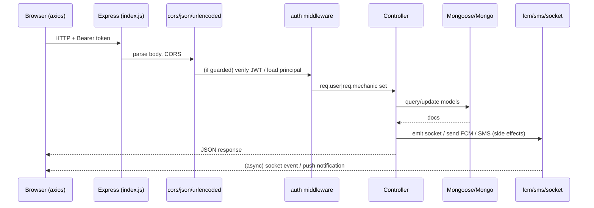
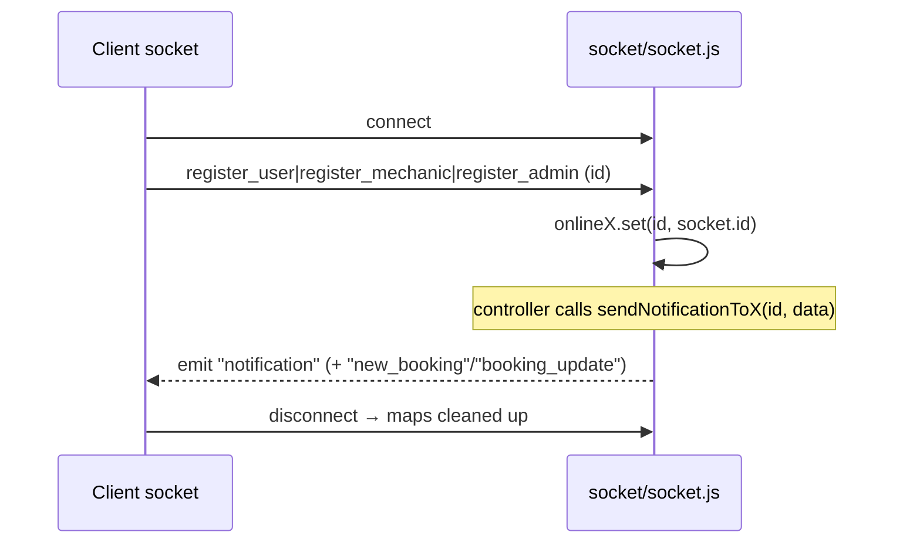

# 08 — Request Flow

## Generic request lifecycle

## Worked example — Customer creates a booking

`POST /api/user/booking-create` → `userprofile.js` (`auth`) → `bookingprocess.createBooking`:

1. `auth` middleware verifies user JWT → `req.user = {id, phone}`.
2. Validate `odometerReading`.
3. Load `User` + `Mechanic`; resolve embedded car by `carId` (`user.carbook.id(carId)`).
4. Load `Services` for selected ids.
5. Create `Booking` (embeds customer + vehicle snapshots, `status:'pending'`).
6. `Mechanic.totalbookings += 1`; push booking id into `user.bookings`; set `user.lastService`.
7. Push a `notifications` entry onto the mechanic doc.
8. **Side effects:** `sendNotificationToMechanic` (socket), `sendNotificationToAllAdmins` (socket), `fcmService.sendToUser(mechanic.fcmToken, …)` (push).
9. Respond `201` with a trimmed booking object.

## Worked example — Mechanic updates booking status

`PUT /api/mechanic/bookings/:id/status` → `authmechanic` → `MechanicControllers.updateBookingStatus`:
1. Reject if booking already `completed`.
2. Update status (scoped to `mechanic: req.mechanic.id`).
3. Resolve customer `User` by `booking.customer.phone`.
4. Socket `booking_update` + FCM push to the customer.
5. Respond with updated booking.

## Worked example — Public mechanic search

`GET /api/public/find?...` → no auth → `PublicControllers.findMechanics`:
1. Build Mongo query from filters (`isActive`, regex search, rating, city, service).
2. Fetch mechanics; compute Haversine distance to `userLat/userLng` in JS.
3. Filter by max distance, sort by distance (or rating), paginate in memory.
4. Return `{ mechanics, totalCount, filters: {cities, services} }`.

## Realtime channel lifecycle

## Notes
- **CORS is fully open** (`cors()` no options; socket `origin:"*"`).
- Body parsing handles JSON + urlencoded.
- No request logging middleware (just scattered `console.log`).
- No rate limiting, no helmet, no compression (see `12_Security.md`).

## Confidence: High.
